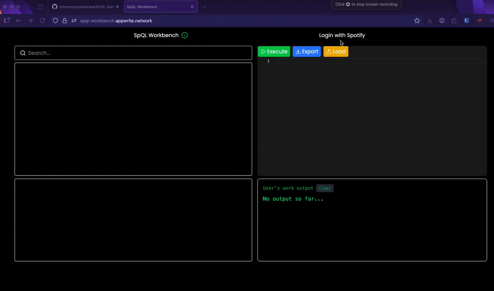

## SpQL Workbench
### Disclaimer
I realized that the Spotify API only allows requests from those who are on the developers list as per [this site](https://developer.spotify.com/documentation/web-api/concepts/quota-modes). Unfortuantely, I realized this way too late before I can change my idea. To use this application follow the instructions [here](https://developer.spotify.com/documentation/web-api/tutorials/getting-started). Create a `.env` file with your credentials. You really only need 2 (`NEXT_PUBLIC_SPOTIFY_REDIRECT_URI` and `NEXT_PUBLIC_SPOTIFY_CLIENT_ID`). Stick the file in the app and run `npm install` then `npm run dev`, the application will run.

### Situation
I created SpQL or, in other words, Spotify Query Language because I wanted to find a new way to create and edit Spotify playlists. I found that trying to mass update a playlist on Spotify requires a lot of dragging dropping. However, making this mass update programmatically is easier on the fingers and can also be fun. 

### Task/Problem
I wanted to make a web application where users can create and edit their playlists on Spotify through a programming language.

### Action
I developed the entire application using next.js and react.js alongside the Spotify API library. 

### Result


This is the interface in which the client interacts with. On the top left pane, we have a search functionality where users can search for songs that they like. The bottom left pane contains the user's playlist. The top right pane contains the code editor where users can write their programs to modify their playlists. The bottom left pane contains the response as a result of executing this programs. 

Some other features include:
- Basic error checking mechanism
- Importing and exporting `.spql` scripts
- Viewing tracks within a playlist by clicking on a playlist of interest.
- Union and intersections of playlists as well

### SpQL Documentation
The very first rule is that any sort of ID and name needs to be wrapped around quotation marks. The second rule is that we often work with IDs instead of user-defined variables. SpQL's variable mapping feature is not that sophisticated. The third rule is that every statement must end in a semi-colon. 

The program below uses every part of SpQL.

```
CREATE PLAYLIST "My Favorites" STORE "fav"; 
CREATE PLAYLIST "Chill Vibes" STORE "chill"; 

ADD TRACK "spotify:track:0d2iYfpKoM0QCKvcLCkBao" TO "fav"; 
ADD TRACK "spotify:track:0d2iYfpKoM0QCKvcLCkBao" TO "chill"; 

ADD TRACKS ["spotify:track:0G17UriYHMjXnZE2OJJSMR","spotify:track:2ox00tcMAjPwq54UpNjrda"] TO "fav"; 

REMOVE TRACK "spotify:track:2ox00tcMAjPwq54UpNjrda" FROM "fav"; 

UNION "fav" WITH "chill" AS "combined"; 
INTERSECT "fav" WITH "chill" AS "common";
```

* Yes, every keyword must be capitalized. 
* You can only use variables like "fav" or "chill" as in the example above if you have stored it prior. Otherwise, you would have to navigate to the bottom left of the pane and click to view the playlist you want to add or delete from and copy it's ID.
